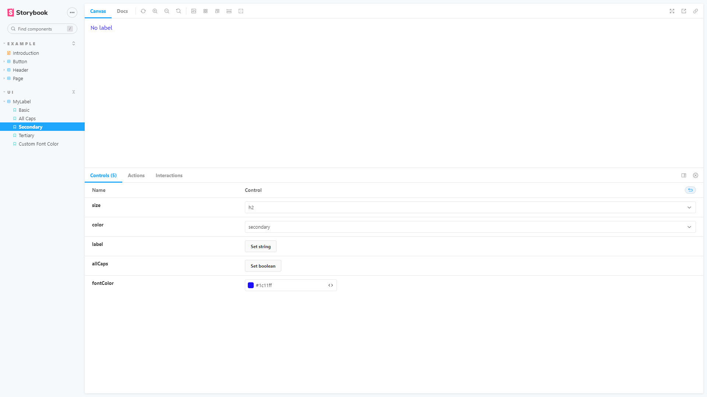

# Storybook Components

Este paquete contiene React Components + StoryBook + NPM Publish

```
npm install gc-my-storybook-components
```

### Esta es una librería hecha por mi, la cual al instalar tiene diferentes tipos de elementos para utilizar y manipular.


